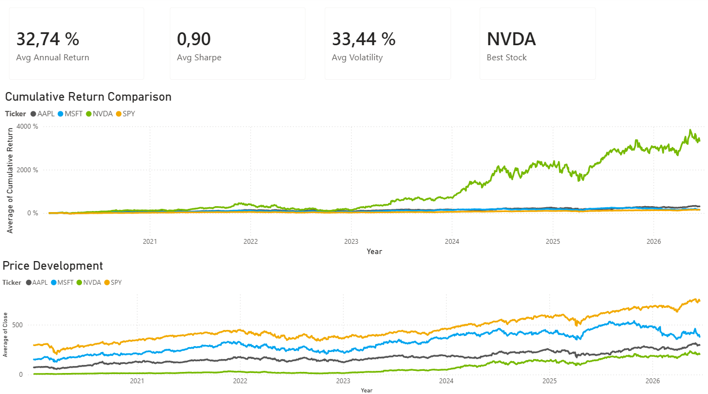
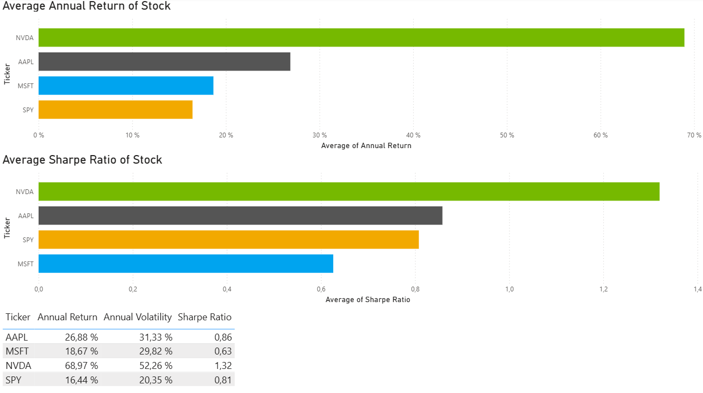
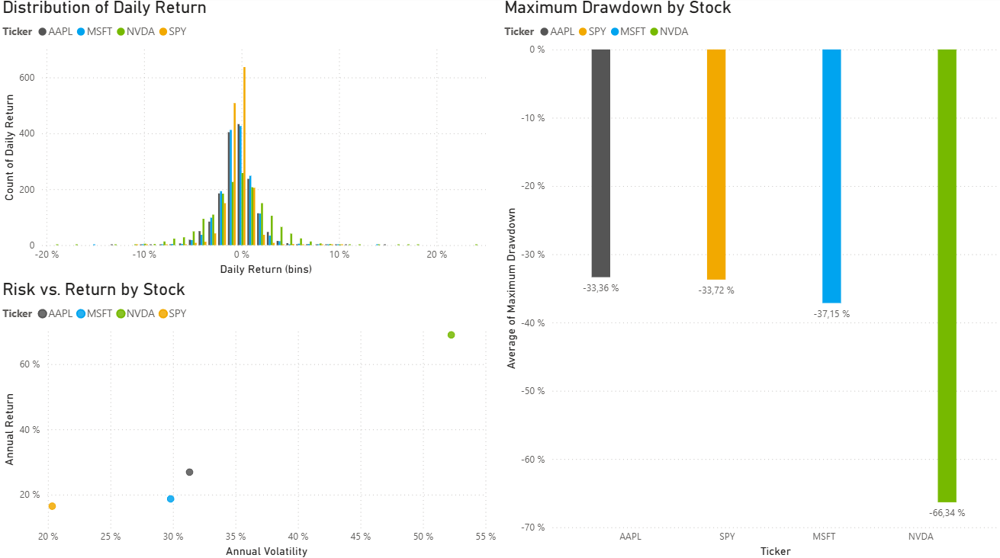
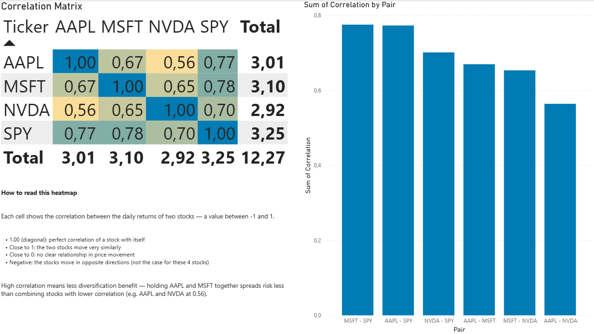

# Stock Analysis Dashboard

## Overview

This project analyzes historical market data using Python and compares the performance and risk characteristics of multiple stocks.

The current version focuses on the comparison between:

- AAPL (Apple Inc.)
- MSFT (Microsoft Corporation)
- NVDA (NVIDIA Corporation)
- SPY (SPDR S&P 500 ETF Trust)

The application retrieves historical price data from Yahoo Finance, calculates key financial metrics, visualizes price trends, and exports the results as CSV files for an interactive Power BI dashboard.

---

## Features

### Data Collection

- Historical market data retrieval using Yahoo Finance
- Automatic data cleaning and preprocessing
- MultiIndex handling for downloaded datasets

### Performance Analysis

- Daily Returns
- Cumulative Returns
- Annual Return

### Risk Analysis

- Daily Volatility
- Annualized Volatility
- Maximum Drawdown
- Sharpe Ratio

### Technical Analysis

- 50-Day Moving Average (MA50)
- 200-Day Moving Average (MA200)

### Visualization

- Historical price chart per stock with moving averages
- Combined cumulative return comparison chart
- Export of charts as PNG images

### Benchmark Comparison

Comparison of AAPL, MSFT, NVDA, and SPY across:

- Annual Return
- Annual Volatility
- Maximum Drawdown
- Sharpe Ratio
- Correlation between daily returns

### Data Export

- CSV export for Power BI integration

---

## Power BI Dashboard

The exported CSVs power a 4-page Power BI dashboard. The ready-to-use report file is included in this repository as [stock_analysis_dashboard.pbix](stock_analysis_dashboard.pbix) — open it directly in Power BI Desktop and click "Refresh" to pull in the latest data from the `data/` folder.

**Executive Summary** — KPI cards (avg. annual return, volatility, Sharpe ratio, best stock), price development chart, cumulative return comparison



**Performance Analysis** — annual return and Sharpe ratio by stock, detailed metrics table



**Risk Analysis** — daily return distribution, risk vs. return scatter plot, maximum drawdown by stock



**Correlation Analysis** — correlation heatmap between all stocks, strongest/weakest correlated pairs



---

## Technologies Used

- Python
- Pandas
- NumPy
- Matplotlib
- Yahoo Finance (yfinance)
- Power BI
- Git
- GitHub

---

## Project Structure

```
stock-analysis-dashboard/
│
├── data/
│   ├── historical_prices.csv
│   ├── comparison_metrics.csv
│   └── correlation_matrix.csv
│
├── images/
│   ├── aapl_analysis.png
│   ├── msft_analysis.png
│   ├── nvda_analysis.png
│   ├── spy_analysis.png
│   └── cumulative_return_comparison.png
│
├── src/
│   ├── main.py
│   ├── data_loader.py
│   ├── metrics.py
│   └── visualization.py
│
├── requirements.txt
└── README.md
```

---

## Example Metrics

| Metric | AAPL | MSFT | NVDA | SPY |
|---|---|---|---|---|
| Annual Return | 26.88% | 18.67% | 68.97% | 16.44% |
| Annual Volatility | 31.33% | 29.82% | 52.26% | 20.35% |
| Maximum Drawdown | -33.36% | -37.15% | -66.35% | -33.72% |
| Sharpe Ratio | 0.86 | 0.63 | 1.32 | 0.81 |

---

## Future Improvements

Planned features include:

- Portfolio analysis with multiple assets
- Additional benchmark comparisons
- CAGR calculation
- Streamlit web dashboard
- Automated reporting

---

## Installation

Clone the repository:

```bash
git clone https://github.com/your-username/stock-analysis-dashboard.git
cd stock-analysis-dashboard
```

Create a virtual environment:

```bash
python -m venv venv
source venv/bin/activate
```

Install dependencies:

```bash
pip install -r requirements.txt
```

Run the project (from the project root):

```bash
python src/main.py
```

---

## Author

Niklas Ringeisen

Digital Business Student
Hochschule Reutlingen
